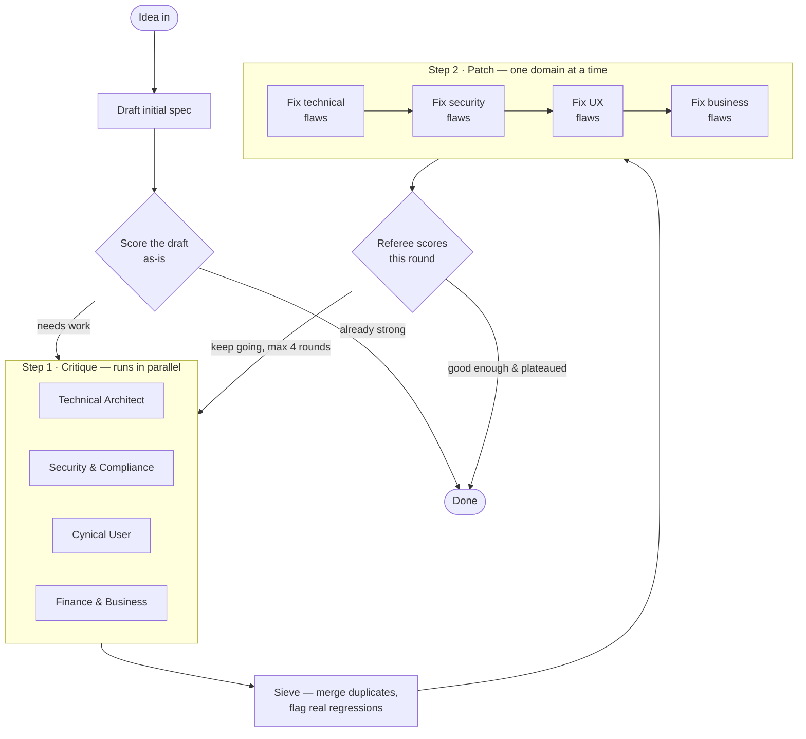

# The Crucible Arena

You give it a one-paragraph product idea. It expands that into a full spec, then throws four critics at it who each tear into a different part of the plan — can it be built, is it legal/secure, would anyone actually use it, does the business make money. Whatever they find gets fixed, and the cycle repeats until the spec is solid or it's gone through enough rounds.

The output is a Markdown report showing how the spec changed round by round, what got flagged, what got fixed, and what's still open.

## How it works

1. **Draft** — a "product manager" agent turns your idea into a real spec: features, architecture, user flow, pricing, the works.
2. **Initial score** — before doing any work, a referee agent scores that draft as-is. If it's already strong across the board, the whole process stops here — no point running critics on a spec that's already good.
3. **Critique** — four critics look at the spec at the same time, each from their own angle:
   - **Technical Architect** — can this actually be built, and will it hold up at scale?
   - **Security & Compliance** — data privacy, app store rules, anything that could get it banned or sued
   - **Cynical User** — would a real person use this, or is there already something better out there?
   - **Finance & Business** — do the numbers work, and is there a realistic way to get users?
   
   Each critic does a quick web search first so their complaints are grounded in something real (competitor names, actual pricing, real platform policies) instead of guessing.
4. **Sieve** — critics work independently, so their findings often overlap. This step merges duplicates and checks whether anything flagged is actually a regression (a problem that was already fixed and came back).
5. **Patch** — one agent per domain fixes only the flaws in its own lane, in sequence, so a finance fix doesn't accidentally undo a technical fix.
6. **Referee** — scores the patched spec on all four axes and decides whether another round is worth running.
7. Repeat from step 3, up to 4 rounds, or stop early once every axis scores well and stops improving.



## Project layout

```
arena/
├── data/
│   └── tech_guardrails.txt   # real-world benchmarks critics can reference
├── state.py                  # data models — the flaw list, scores, spec state
├── agents.py                 # every prompt, and the LLM calls that use them
└── main.py                   # wires it all into a graph, writes the report, CLI
main.py                        # just calls arena.main.main()
```

- **state.py** — plain data models (Pydantic) for everything that needs to persist across rounds: the running spec text, the list of flaws raised so far, scores per round. There's no chat history anywhere — just this structured state, updated each round.
- **agents.py** — the actual prompts and the code that calls the model with them. Nothing provider-specific beyond a single `ChatOpenAI` client.
- **main.py** — builds the round-by-round flow using LangGraph, handles flaw bookkeeping (assigning IDs, tracking what's resolved), decides when to stop, and writes the final report.

## Setup

```
uv sync
copy .env.example .env
```

Open `.env` and add your OpenAI key:

```
OPENAI_API_KEY=sk-your-key-here
CRUCIBLE_MODEL=gpt-4.1
```

`CRUCIBLE_MODEL` can be any OpenAI model that supports structured/tool-calling output — `gpt-4.1`, `gpt-4o`, `gpt-4o-mini` all work. Cheaper models will run faster but critiques may be less sharp.

## Usage

```
uv run main.py
```

You'll be asked for your product idea. Once it's done, check `crucible_report.md` for the full writeup — score history, what was fixed each round, what's still open, and the final spec.

A full run makes a lot of model calls (one per critic per round, plus search, sieve, patch, and referee calls), so expect it to take a few minutes depending on how many rounds it goes through.
